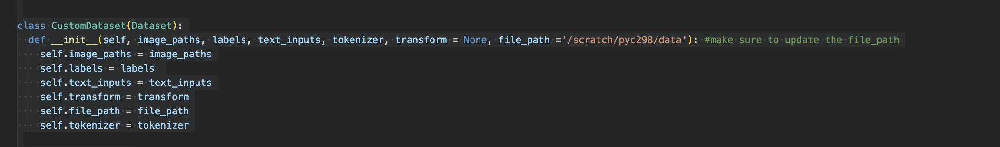
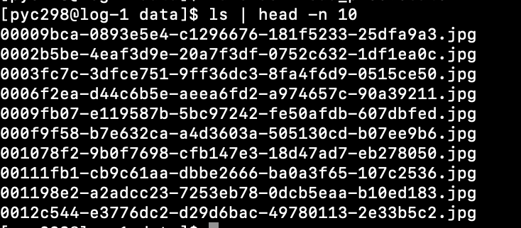
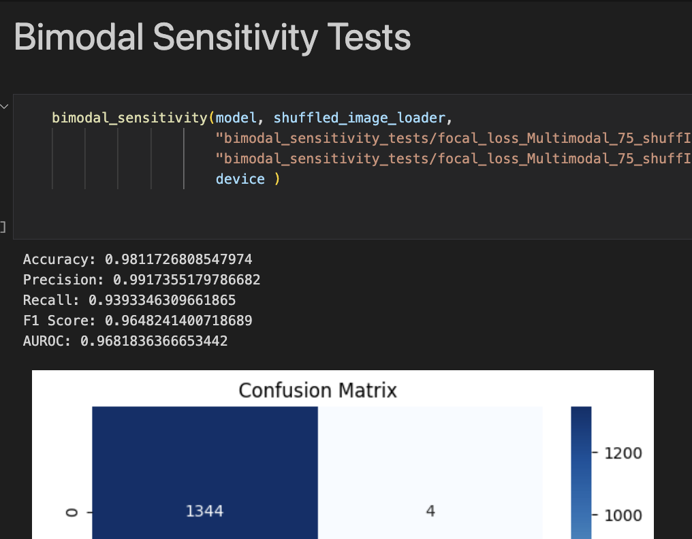
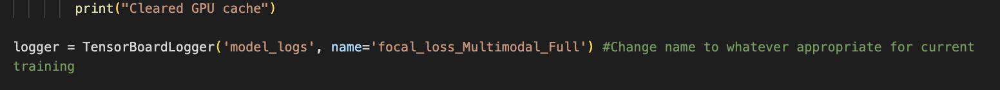

# Multimodal Pneumonia Detection Model

This collection of 3 Jupyter notebooks demonstrates the development of a deep learning model that integrates both image and textual data to diagnose pneumonia along with the two Uni-modal models that it is composed of. It leverages PyTorch, PyTorch Lightning, and the Hugging Face Transformers library to train a model using both chest X-ray images and associated clinical text.

## Abstract:
The efficient integration of multimodal data is a cornerstone of robust deep learning applications, particularly in healthcare, where diverse patient information can significantly impact diagnostic accuracy. The primary objective of this project is to develop a multi-modal
model that can integrate MIMIC IV CXR imaging data with corresponding radiology notes
to distinguish between ’pneumonia’ and ’not pneumonia’ cases. These non-pneumonia cases
are the absence of any abnormal pulmonary diseases classified by the ChexPert model. A
critical aspect of this project is confronting the significant class imbalance present in medical
datasets, which often feature a disproportionate number of non-disease instances(Welvaars
et al., 2023). Through extensive experiments on the medical dataset, we explore the behaviors and characteristics of the multi-modal models and observe relative improvements
to the robustness and reliability for a more balanced learning process. We particularly
focused on reducing the effects of class imbalance through sub-sampling and implementing
different loss functions. Our results demonstrate that multi-modal models, which integrate
both text and image data, were able to perform competitively with their single modality
counterparts across a variety of metrics in a context where class imbalance was less significant. These findings hold value for those considering the deployment of machine learning
models in clinical settings, where accurate interpretation of multi-modal data is ideal for
patient outcomes.


## Prerequisites

Before running this notebook, ensure you have the following:

- Python 3.8 or above
- PyTorch 1.8 or later
- PyTorch Lightning
- Hugging Face Transformers
- Matplotlib
- Seaborn
- Pandas
- NumPy
- Scikit-learn

You can install the necessary libraries via pip:

```bash
pip install torch torchvision torchaudio pytorch-lightning transformers matplotlib seaborn pandas numpy scikit-learn
```

GPU training is recommended for the code contained in this repo.

## Dataset

The model expects a dataset containing labeled images and their corresponding text descriptions. The dataset should be structured as a CSV file with at least the following columns:

- `image_path`: Path to the image file.
- `is_pneumonia`: Binary label indicating the presence of pneumonia (1 for positive, 0 for negative).
- `free_text`: Clinical notes or text associated with each image.


## Downloading the Dataset

The model requires a specific dataset from the MIMIC-CXR-JPG repository. Follow the steps below to download the necessary images:

### Prerequisites
- Ensure you have `wget` installed on your system. If `wget` is not available by default, you may need to load it using a module system on your server (common in HPC environments).
- You will need access credentials for the PhysioNet repository where the MIMIC-CXR-JPG dataset is hosted. Obtain these credentials by registering or logging into the [PhysioNet website](https://physionet.org/).

### Download Instructions

1. **Set Up the Environment**:
   - Navigate to the directory where you want to download the data.
   - Ensure you have sufficient storage available as the dataset is large.

2. **Download Script**:
   - Use the provided Bash script to automate the download of image files. Here is the script you need to execute:

```bash
#!/bin/bash
#SBATCH --job-name=download_files
#SBATCH --output=download_files_%j.out
#SBATCH --error=download_files_%j.err
#SBATCH --time=24:00:00
#SBATCH --nodes=1
#SBATCH --ntasks-per-node=10

# Directory to store the downloaded files
DESTINATION="/scratch/your_username/data"

# Base URL for the file downloads
BASE_URL="https://physionet.org/files/mimic-cxr-jpg/2.0.0/"

# File containing the list of paths to download
FILE_PATHS="picturepaths.txt"

# Ensure the destination directory exists
mkdir -p $DESTINATION

# Use xargs to parallelize wget downloads
cat "$FILE_PATHS" | xargs -n 1 -P 10 -I {} wget --user="YOUR_USERNAME" --password='YOUR_PASSWORD' -c "${BASE_URL}{}" -P $DESTINATION

echo "All files downloaded."

```

## Usage

1. **Data Preparation**: Load your data and split it into training, validation, and test sets.
> - Update the file path variables in the notebook to point to your dataset location. The two provided csv datasets are "final_cxr_free_text75.csv" and "final_cxr_free_text.csv" for the subsampled and full datasets.

> - As well, during the creation of the custom dataset for training and evaluation, ensure that the datapath to the images are correctly updated according to where the downloaded files from the above bash script are stored.

> - The structure of the CXR images directory should be /Dir_Name/(* images in .jpg). There should not be any nesting of subdirectories.
2. **Model Training**: Use the provided `MultimodalModel` `ImageModel` or `TextModel ` class to train the model on your dataset depending on which .ipynb notebook you are running. The provided jupyter notebooks both include the training loops defined for the full and subsampled datasets. 
> - Depending on which loss function you decide to train with, include the intended one in the pytorch lightning trainer instantiation within the script and name everything including logs and experiment results appropriately prior to running. 

```python
from pytorch_lightning.callbacks import EarlyStopping
from pytorch_lightning import Callback
from pytorch_lightning.loggers import TensorBoardLogger
train_steps_per_epoch = len(train_dataset) // batch_size + (len(train_dataset) % batch_size > 0)


class ClearCacheCallback(Callback):
    def on_epoch_end(self, trainer, pl_module):
        torch.cuda.empty_cache()
        print("Cleared GPU cache")

logger = TensorBoardLogger('model_logs', name='focal_loss_Multimodal_Full') #Change name to whatever appropriate for current training

# Callbacks
clear_cache_callback = ClearCacheCallback()

early_stop_callback = EarlyStopping(
    monitor='val_loss',    
    patience=3,          
    verbose=True,
    mode='min'            # 'min' or 'max' (whether the monitored quantity should decrease or increase)
)
trainer = pl.Trainer(logger=logger, 
                     log_every_n_steps=50,  # Log at the end of each epoch
                     callbacks=[early_stop_callback, clear_cache_callback],
                     max_epochs=15, 
                     devices=1, 
                     accelerator="gpu" if torch.cuda.is_available() else "cpu") # Automatically choose GPU if available

model = MultimodalModel(num_classes=1, loss_function = FocalLoss()) #or nn.BCEWithLogitsLoss())
trainer.fit(model, train_dataloaders=train_loader, val_dataloaders =valid_loader)
trainer.test(model, dataloaders=test_loader)
```

> - When running focal loss in training, reminder that gamma and alpha values are at a default of 1.5 and 0.85 respectively, make alterations if different values are required. 


3. **Evaluation**: Evaluate the model using the validation and test datasets to understand its performance.
- If running Multimodal.ipynb, there are also Bimodal sensitivity tests that can be run after the other evaluations.


4. **Logging and Monitoring**: The training process logs metrics which can be viewed using TensorBoard.
> - The model_logs prior to training should be named appropriately for proper viewing. 


## Features

- **Custom Dataset Class**: Handles the loading and preprocessing/normalization of image and text data.
- **Multimodal Learning**: Combines features extracted from both images (using a modified ResNet50) and text (using BioBERT) to make predictions.
- **Evaluation Metrics**: Includes accuracy, precision, recall, F1 score, and AUROC for performance assessment.
- **Model Checkpoints, Early Stopping and Logging**: Integrated with PyTorch Lightning's logging and model checkpointing features along with early stopping callbacks from pytorch-lightning.


